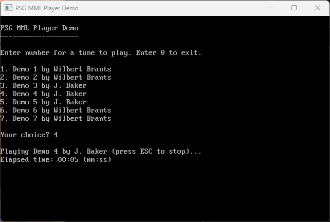

# What is this?

This is a [QB64-PE](https://github.com/QB64-Phoenix-Edition/QB64pe) library for playing [MML](https://en.wikipedia.org/wiki/Music_Macro_Language) music and sounds using [Macrotune PSG](https://www.posemotion.com/macrotune/). [Macrotune](https://www.posemotion.com/macrotune/) is a [Music Macro Language](https://en.wikipedia.org/wiki/Music_Macro_Language) ([MML](https://en.wikipedia.org/wiki/Music_Macro_Language)) editor to easily create “retro” style music for an app, game or just for fun!



## Features

- Easy plug-&-play API optimized for demos & games
- Works on Windows and macOS (no Linux support yet)
- Demo player that shows how to use the library

## Music Macro Language

```text
R        rest (if number follows, rest length)
CDEFGAB  note names (if number follows, note length)
+ or #   sharp
-        flat
.        increase note length by half
<        octave - 1
>        octave + 1
O        octave (0 - 8)
K        transpose (-24 - +24)
L        note length (1 - 32)
T        tempo (0 - 15)
V        volume (0 - 63)
V+       increase volume
V-       decrease volume
W        waveform (0 = triangle, 1 = sawtooth, 2 = complex a, 3 = complex b, 4 = square, 5 = noise on channel1)
\        decay speed (0 = no decay) or volume envelope (0-9) (read below)
:        loop
*        post event (number can be retrieved in PureBasic with EventData() )

Volume Envelope & Decay

The volume envelope uses the same "\" character as decay. This is because the decay doesn't work when using
a volume envelope. If you want to use the "\" as a decay, just type a backslash followed by a number. Such as,
"\2". If you want to use the "\" as a volume envelope, just type the backslash with multiple numbers that are
separated by commas. Such as, "\1,9,2,5". If you don't want the volume envelope to have interpolation, then
type a period after the backslash. Such as, "\.1,9,2,5".

Tempo = BPM

T0  =  40 BPM
T6  =  60 BPM
T9  =  80 BPM
T10 =  90 BPM
T11 = 103 BPM
T12 = 120 BPM
T13 = 144 BPM
T14 = 180 BPM
T15 = 240 BPM
```

## API

```VB
Function PSG_IsPlayingMML&
Sub PSG_PlayMML (Channel0 As String, Channel1 As String, Channel2 As String, Channel3 As String)
Sub PSG_SetMasterVolume (ByVal Volume As Single)
Sub PSG_Sound (ByVal Channel As Unsigned Long, Byval Frequency As Single, Byval Volume As Unsigned Long, Byval Waveform As Unsigned Long)
Sub PSG_Terminate
```
